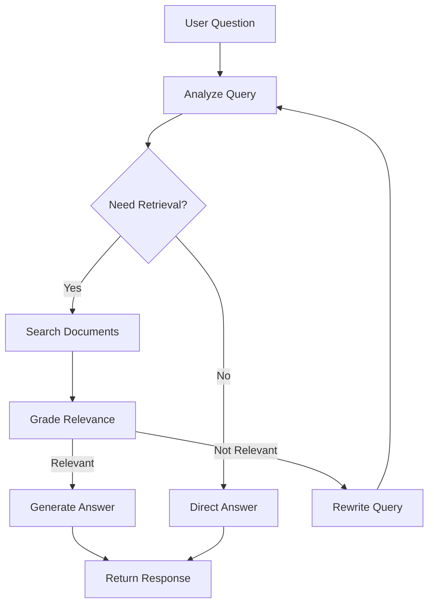

# Agentic RAG Application


A full-stack intelligent document Q&A system powered by Agentic Retrieval-Augmented Generation (RAG). This application combines LangGraph's agentic workflow with modern vector search to provide accurate, context-aware answers from your documents.

## 🌟 Features

### Core Capabilities
- **🤖 Agentic RAG**: Self-improving retrieval with query rewriting and document grading
- **📚 Multi-Document Support**: Upload and index academic papers, reports, and PDFs
- **💬 Contextual Chat**: Maintains conversation history for coherent multi-turn dialogues
- **🔍 Hybrid Search**: Combines dense and sparse retrieval for better accuracy
- **📊 Processing Transparency**: Real-time visibility into agent's reasoning process
- **🎯 Smart Routing**: Automatically determines when to retrieve documents vs. direct response

### Technical Highlights
- **LangGraph-based workflow** with intelligent query generation and document grading
- **Docling PDF parsing** for advanced document structure extraction
- **Milvus vector database** with namespace isolation for multi-user support
- **OpenAI GPT-4** for reasoning and answer generation
- **Jina Embeddings v3** for semantic document retrieval
- **React + Vite frontend** with modern UI components

## 🏗️ Architecture

```
┌─────────────────────────────────────────────────────────────┐
│                     Frontend (React)                         │
│  ┌────────────┐  ┌────────────┐  ┌──────────────────────┐  │
│  │  ChatBox   │  │ Documents  │  │  Processing Status    │  │
│  │  Component │  │ Management │  │    Visualization      │  │
│  └────────────┘  └────────────┘  └──────────────────────┘  │
└─────────────────────────┬───────────────────────────────────┘
                          │ HTTP/REST API
                          ↓
┌─────────────────────────────────────────────────────────────┐
│                   Backend (FastAPI)                          │
│  ┌───────────────────────────────────────────────────────┐  │
│  │              Agentic RAG (LangGraph)                  │  │
│  │  ┌─────────────────────────────────────────────────┐ │  │
│  │  │ 1. Query Analysis & Generation                   │ │  │
│  │  │ 2. Document Retrieval (Multi-Vector Store)       │ │  │
│  │  │ 3. Relevance Grading                             │ │  │
│  │  │ 4. Query Rewriting (if needed)                   │ │  │
│  │  │ 5. Answer Generation with Citations              │ │  │
│  │  └─────────────────────────────────────────────────┘ │  │
│  └───────────────────────────────────────────────────────┘  │
│                                                               │
│  ┌──────────────┐  ┌──────────────┐  ┌─────────────────┐   │
│  │   Parser     │  │  Embeddings  │  │   Routers       │   │
│  │  (Docling)   │  │   (Jina)     │  │ (User/Chat/Doc) │   │
│  └──────────────┘  └──────────────┘  └─────────────────┘   │
└────┬──────────┬────────────┬────────────┬───────────────────┘
     │          │            │            │
     ↓          ↓            ↓            ↓
┌─────────┐ ┌────────┐ ┌─────────┐ ┌──────────┐
│ MongoDB │ │ Milvus │ │ AWS S3  │ │  OpenAI  │
│ (Users/ │ │(Vector │ │  (File  │ │   API    │
│  Chats) │ │ Store) │ │ Storage)│ │  (LLM)   │
└─────────┘ └────────┘ └─────────┘ └──────────┘
```

## 🚀 Quick Start

### Prerequisites

Ensure you have the following installed and running:

- **Python 3.13+** 
- **Node.js 18+** and npm
- **MongoDB** (local or cloud instance)
- **Milvus Vector Database** (Zilliz Cloud or self-hosted)
- API Keys:
  - OpenAI API key
  - Jina AI API key
  - AWS credentials (for S3 document storage)

### Installation

#### 1. Clone the Repository

```bash
git clone https://github.com/hlinh96it/fullstack-rag-agent-thought-app.git
cd fullstack-rag-agent-thought-app
```

#### 2. Backend Setup

```bash
cd backend

# Install dependencies using pip
pip install -e .

# Or if you have Poetry installed
poetry install

# Copy environment template
cp .env.example .env
```

Edit `backend/.env` with your credentials:

```bash
# OpenAI Configuration
OPENAI__OPENAI_API_KEY=sk-...
OPENAI__MODEL_NAME=gpt-4o-mini
OPENAI__TEMPERATURE=0.7
OPENAI__TIMEOUT=3000

# MongoDB Configuration
MONGO__MONGO_URI=mongodb://localhost:27017
MONGO__MONGO_DATABASE=rag_app
MONGO__MONGO_COLLECTION=users

# AWS S3 Configuration
AWS__ACCESS_KEY=your_access_key
AWS__SECRET_KEY=your_secret_key
AWS__REGION=us-east-1
AWS__BUCKET_NAME=your_bucket_name

# Milvus Configuration
MILVUS__URI=https://your-milvus-instance.com
MILVUS__API_KEY=your_milvus_api_key
MILVUS__COLLECTION_NAME=paper_embeddings
MILVUS__NAMESPACE=default

# Jina Embeddings
JINA__EMBEDDING_URL=https://api.jina.ai/v1/embeddings
JINA__JINA_API_KEY=your_jina_api_key
JINA__MODEL_NAME=jina-embeddings-v3

# PDF Parser Settings
PDF_PARSER__MAX_PAGES=30
PDF_PARSER__MAX_FILE_SIZE_MB=20
PDF_PARSER__DO_TABLE_STRUCTURE=True
```

#### 3. Frontend Setup

```bash
cd ../frontend

# Install dependencies
npm install
```

#### 4. Start the Application

**Terminal 1 - Backend:**
```bash
cd backend
uvicorn src.main:app --reload --host 0.0.0.0 --port 8000
```

**Terminal 2 - Frontend:**
```bash
cd frontend
npm run dev
```

Access the application:
- **Frontend**: http://localhost:5173
- **API Docs**: http://localhost:8000/docs
- **Health Check**: http://localhost:8000/health

## 📖 Usage Guide

### 1. Document Management

1. Navigate to the **Documents** tab
2. Click **Upload Documents**
3. Select PDF files (academic papers, reports, etc.)
4. Documents are automatically:
   - Uploaded to S3
   - Parsed with Docling
   - Chunked intelligently
   - Embedded with Jina v3
   - Indexed in Milvus

### 2. Asking Questions

1. Go to the **Chat** interface
2. Type your question in natural language
3. The agent will:
   - Analyze your question
   - Search relevant documents
   - Grade document relevance
   - Rewrite query if needed
   - Generate a comprehensive answer

### 3. Understanding Agent Behavior

The agent operates in a graph-based workflow:



**Example Queries:**

- **Simple**: "What is machine learning?" → Direct answer
- **Document-based**: "Explain the transformer architecture from my papers" → Retrieves and cites
- **Follow-up**: "Can you elaborate on the attention mechanism?" → Uses conversation context

## 🔧 Configuration

### Backend Configuration (`backend/src/config.py`)

Key settings you can adjust:

```python
# Agent Configuration
MAX_SEARCHES = 3          # Max retrieval attempts
MAX_REWRITES = 1          # Max query rewrites
RETRIEVAL_K = 4           # Documents to retrieve

# Parser Configuration  
MAX_PAGES = 30           # Max PDF pages to process
MAX_FILE_SIZE_MB = 20    # Max file size
DO_TABLE_STRUCTURE = True # Extract tables

# LLM Configuration
MODEL_NAME = "gpt-4o-mini"
TEMPERATURE = 0.7
TIMEOUT = 3000           # milliseconds
```

### Vector Store Configuration

In `backend/src/main.py`, customize retrieval:

```python
vector_stores = [
    {
        'store': milvus_client.vector_store,
        'name': 'paper_retriever',
        'description': 'Academic papers and research documents',
        'k': 4,                      # Number of documents to retrieve
        'ranker_weights': [0.6, 0.4] # Dense vs. sparse weights
    }
]
```

## 🧪 Testing

### Backend Tests

```bash
cd backend

# Test agent functionality
python test_agent.py

# Check setup
python check_setup.py

# Run all tests
pytest
```

### API Testing

```bash
# Check health
curl http://localhost:8000/health

# Get agent status
curl http://localhost:8000/ask/status

# Ask a question
curl -X POST http://localhost:8000/ask \
  -H "Content-Type: application/json" \
  -d '{"prompt": "What is RAG?"}'
```

## 📦 Project Structure

```
agentic-rag-app/
├── backend/
│   ├── src/
│   │   ├── main.py                 # FastAPI application entry
│   │   ├── config.py               # Configuration management
│   │   ├── dependencies.py         # Dependency injection
│   │   ├── router/
│   │   │   ├── ask.py             # Agent Q&A endpoints
│   │   │   ├── chat.py            # Chat management
│   │   │   ├── document.py        # Document upload/management
│   │   │   ├── user.py            # User management
│   │   │   └── aws.py             # S3 operations
│   │   ├── services/
│   │   │   ├── chat/
│   │   │   │   ├── agent.py       # Agentic RAG implementation
│   │   │   │   ├── factory.py     # Service factory
│   │   │   │   ├── openai_client.py # OpenAI wrapper
│   │   │   │   └── prompts.py     # System prompts
│   │   │   ├── database/
│   │   │   │   ├── mongo_client.py  # MongoDB operations
│   │   │   │   ├── milvus_client.py # Vector DB operations
│   │   │   │   └── aws_client.py    # S3 client
│   │   │   ├── embedding/
│   │   │   │   └── jina_client.py   # Jina embeddings
│   │   │   └── parser/
│   │   │       ├── parser.py        # Docling PDF parser
│   │   │       └── pipeline.py      # Processing pipeline
│   │   └── schema/
│   │       ├── llm/models.py        # LLM request/response models
│   │       ├── document/models.py   # Document schemas
│   │       └── user/models.py       # User schemas
│   ├── assets/                      # Static assets
│   ├── pyproject.toml              # Python dependencies
│   └── README.md
│
├── frontend/
│   ├── src/
│   │   ├── App.jsx                 # Main React component
│   │   ├── main.jsx                # Entry point
│   │   ├── components/
│   │   │   ├── ChatBox.jsx        # Chat interface
│   │   │   ├── Message.jsx        # Message component
│   │   │   ├── ProcessingStatus.jsx # Agent status display
│   │   │   ├── References.jsx     # Citation display
│   │   │   ├── Sidebar.jsx        # Navigation sidebar
│   │   │   ├── Document/          # Document management components
│   │   │   └── ui/                # Reusable UI components
│   │   ├── api/
│   │   │   ├── ask.js             # Agent API calls
│   │   │   ├── chat.js            # Chat API
│   │   │   ├── doc.js             # Document API
│   │   │   └── user.js            # User API
│   │   ├── context/
│   │   │   └── AppContext.jsx     # Global state management
│   │   └── hooks/                 # Custom React hooks
│   ├── package.json
│   └── README.md
│
├── QUICKSTART.md                   # Quick setup guide
├── AGENT_INTEGRATION.md            # Agent architecture docs
├── COMMANDS.md                     # CLI commands reference
└── README.md                       # This file
```

## 🔑 Key Components

### Backend

#### AgenticRAG (`backend/src/services/chat/agent.py`)

The core intelligence of the system. Implements a LangGraph-based workflow:

- **Query Analysis**: Determines retrieval necessity
- **Document Retrieval**: Multi-vector store support
- **Relevance Grading**: LLM-based document scoring
- **Query Rewriting**: Improves retrieval with reformulation
- **Answer Generation**: Context-aware response synthesis

#### Parser Service (`backend/src/services/parser/parser.py`)

Handles document processing with Docling:

- PDF parsing with structure preservation
- Table extraction
- Section identification
- Intelligent chunking
- Metadata extraction

#### Vector Store Client (`backend/src/services/database/milvus_client.py`)

Manages Milvus operations:

- Document indexing with namespace isolation
- Hybrid search (dense + sparse)
- Metadata filtering
- Collection management

### Frontend

#### ChatBox Component (`frontend/src/components/ChatBox.jsx`)

Main chat interface with:

- Real-time message streaming
- Conversation history management
- Processing status visualization
- Error handling and retry logic

#### ProcessingStatus Component (`frontend/src/components/ProcessingStatus.jsx`)

Displays agent's reasoning process:

- Step-by-step progress tracking
- Retrieved document preview
- Completion indicators

## 🔒 Security Considerations

- **API Keys**: Store in `.env`, never commit to version control
- **Namespace Isolation**: Each user's documents are isolated in Milvus
- **Input Validation**: All user inputs are sanitized
- **CORS**: Configured for development; update for production
- **Authentication**: Implement JWT or OAuth for production use

## 🚀 Deployment

### Backend Deployment

1. **Environment Variables**: Set all required env vars
2. **Database**: Ensure MongoDB and Milvus are accessible
3. **WSGI Server**: Use Gunicorn or Uvicorn with multiple workers
4. **Reverse Proxy**: Configure Nginx for SSL/TLS
5. **Monitoring**: Set up logging and error tracking

```bash
# Production command
gunicorn src.main:app -w 4 -k uvicorn.workers.UvicornWorker --bind 0.0.0.0:8000
```

### Frontend Deployment

```bash
cd frontend
npm run build

# Deploy dist/ folder to:
# - Vercel
# - Netlify
# - AWS S3 + CloudFront
# - Any static hosting service
```

## 🤝 Contributing

Contributions are welcome! Please:

1. Fork the repository
2. Create a feature branch (`git checkout -b feature/amazing-feature`)
3. Commit changes (`git commit -m 'Add amazing feature'`)
4. Push to branch (`git push origin feature/amazing-feature`)
5. Open a Pull Request

## 📝 License

This project is licensed under the MIT License - see the LICENSE file for details.

## 🙏 Acknowledgments

- **LangChain** & **LangGraph** for the agentic framework
- **Docling** for advanced PDF parsing
- **Milvus** for vector database capabilities
- **Jina AI** for embedding models
- **OpenAI** for GPT models
- **shadcn/ui** for beautiful React components

## 📞 Support

- **Issues**: [GitHub Issues](https://github.com/hlinh96it/fullstack-rag-agent-thought-app/issues)
- **Documentation**: See `QUICKSTART.md` and `AGENT_INTEGRATION.md`
- **Email**: Contact the maintainers

## 🗺️ Roadmap

- [ ] Streaming responses for real-time feedback
- [ ] Multi-modal support (images, tables)
- [ ] Advanced citation tracking
- [ ] Custom retrieval strategies
- [ ] User authentication & authorization
- [ ] Document summarization
- [ ] Export conversations to PDF
- [ ] Multi-language support
- [ ] Fine-tuned embedding models
- [ ] Agent reasoning visualization

---

**Built with ❤️ by the RAG Community**

*Version 2.0.0 - November 2025*
